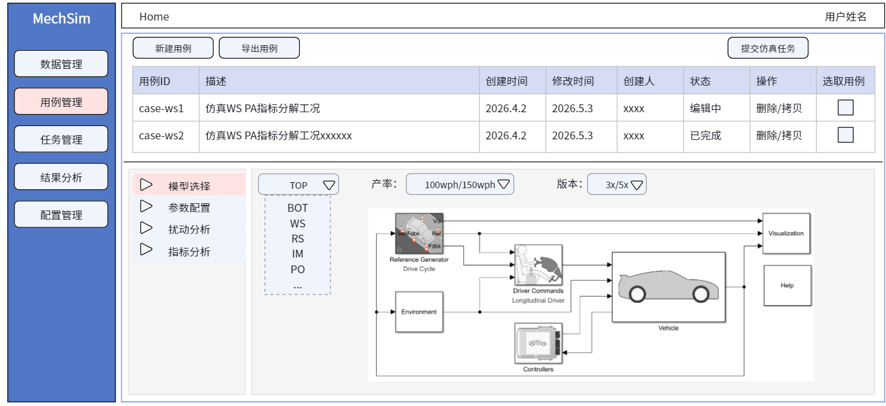

前端可以使用aurora-design/vue组件替换的内容，全部使用aurora-design/vue组件实现，前端收到的所有错误返回都弹窗在界面中间，显示详细错误信息,折线图还是用uplot实现
整体页面最左边添加总的导航，分别为用例编排，任务管理，数据查看

打开前端界面时，前端请求queue_cases接口获取case信息，将case中的内容name，description,create_by，create_time按行渲染，name和description可编辑
前端实现新增Case按钮，点击按钮时，弹出窗口，填写Case名称，Case描述,点击Add，调用后端add_case接口，把信息传入后端保存
用例编辑界面放在Case界面下方,上下空间可以拖动调整，默认各50%
用例编辑界面包含四个主题，放在左边，作为四个树，每个树的顶层是主题名字，树的内容使用懒加载：
模型选择：则调用后端queue_model_info,获取所有模型信息，模型信息显示在右侧，渲染为下拉单选框，再添加两个下拉框: 1产率，有两个选项{100WPH,150WPH},单选；2，版本，两个选项{3X,5X},单选，根据case信息渲染，如果某个信息为空则默认勾选第一个
参数配置：利用case信息中的model_param，如果model_param为空，则根据tab1中系统名称从queue_model_info返回的信息中查询该系统的参数信息，然后按照参数层级渲染成树状结构，但最后一层显示在树状右侧的面板中，树中选择不同的位置，右侧更新为其对应的参数列表，并且这个参数可编辑
扰动分析：利用case信息中的disturbance，如果disturbance字段为空，则调用后端queue_disturbances获取信息，然后按照层级将所有内容渲染为树状结构，只有最后一层文件可勾选，不支持勾选文件夹，支持多选；点击最后一层的扰动数据名称时，调用get_disturbance_info传入数据路径，获取详细数据，将详细数据利用uplot组件画折线图；显示返回的所有变量，并可勾选，勾选后渲染到图中
指标分析：此页面暂不填充内容
单独提供一个保存按钮，点击保存时，将产率，版本，模型，模型参数，扰动信息，通过调用update_case接口更新到数据库
添加一个复制Case的操作，自动从源Case的所有信息复制一个新的Case，名字后边加_copy

后端添加查询接口，查询Case中发生变化的model_param，使用deepdiff组件实现，返回所有发生变化的值
后端添加用户权限控制，created_by字段是owner，添加Case分享按钮，如果添加了另一个人的权限，另一个人在界面中可以显示此Case信息

工作空间的ROOT路径默认为D:\Project\ROOT\WorkSpace，添加到环境变量配置文件中
创建Task时，前端点击Case的创建Task按钮，会弹窗，显示所有的差异参数，弹窗中有运行按钮，点击运行按钮，就会调用后端add_task接口，task传入的matlab的json，修改为以文件方式存储，传入matlab为文件路径,前端调用add_task时，在工作空间中创立文件夹，名字格式为task_{task_id},